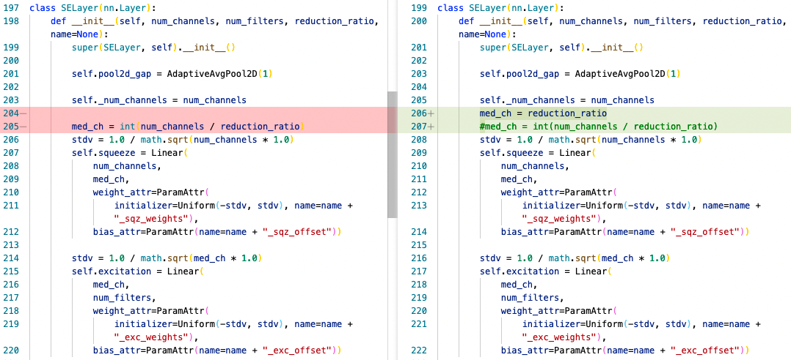
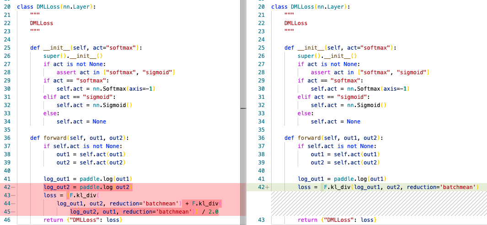

# XCiT：协方差图像全思变换网络

## 简介

这是《[XCiT: Cross-Covariance Image Transformers](https://arxiv.org/pdf/2106.09681v2.pdf)》的基于[PaddleClas](https://github.com/PaddlePaddle/PaddleClas)的飞桨实现，官方的PyTorch实现在[这里](https://github.com/facebookresearch/xcit)。对于xcit_nano_12_p8 224§模型，论文经过400个轮次达到了76.3%的精度，而我只达到了74.6%。

## 文件说明

### 本仓库中的文件

```bash
.
├── imgs/ #README中的图片文件
├── training_log/ #训练中产生的日志
├── ppcls/
│   └── arch/backbone/model_zoo/xcit.py # XCiT模型文件
├── tools/ # 拷贝自PaddleClas
├── xcit_nano_12_p8_224.yml # XCiT不蒸馏训练配置
├── xcit_nano_12_p8_224_dist.yml # XCiT蒸馏训练配置
└── README.md # 自述文件
```

### 模型参数文件

我把可能用到的参数文件放在百度云中：

> 链接: https://pan.baidu.com/s/1ugQVrrYMXjsn83eRRlSBuQ  密码: ewki

其中`xcit_nano_12_p8_224_dist.pdparams`是从PyTorch直接转换过来的模型参数文件，`regnety_160.pdparams`是由从PyTorch直接转换过来的教师模型参数文件。而`epoch_400.pdparams`是我训练完400轮后的参数文件，`best_model.pdparams`是训练过程中在验证集上表现最好的参数文件（事实上是在第395轮达到74.6%）。

## 快速开始

### 数据集

我使用的数据集是AI Studio上压缩的过的ImageNet-1k数据集：

https://aistudio.baidu.com/aistudio/datasetdetail/114241
https://aistudio.baidu.com/aistudio/datasetdetail/114746

下载数据集后注意调整`xcit_nano_12_p8_224.yml`和`xcit_nano_12_p8_224_dist.yml`中的数据集路径。

### 训练

单机四卡：

```bash
python -m paddle.distributed.launch --gpus="0,1,2,3" tools/train.py \
       -c xcit_nano_12_p8_224_dist.yml
```

单机单卡：

```bash
python tools/train.py -c xcit_nano_12_p8_224_dist.yml
```

### 评估

评估我训练出的模型：

```bash
python tools/eval.py -c xcit_nano_12_p8_224_dist.yml
```

在前面提到的压缩过的ImageNet-1k验证集上的结果是

> ```
> root INFO: [Eval][Epoch 0][Avg]CELoss_Student: 1.06059, loss: 1.06059, top1: 0.74690, top5: 0.91976
> ```

在[原版ImageNet-1k验证集](https://aistudio.baidu.com/aistudio/datasetdetail/68594)上的结果是

> ```
> root INFO: [Eval][Epoch 0][Avg]CELoss_Student: 1.05958, loss: 1.05958, top1: 0.74726, top5: 0.91998
> ```


评估由PyTorch直接转来的模型：

```bash
python tools/eval.py -c xcit_nano_12_p8_224.yml \
                     -o Global.pretrained_model=xcit_nano_12_p8_224_dist
```

在前面提到的压缩过的ImageNet-1k验证集上的结果是

> ```
> root INFO: [Eval][Epoch 0][Avg]CELoss: 0.99515, loss: 0.99515, top1: 0.76128, top5: 0.92996
> ```

在[原版ImageNet-1k验证集](https://aistudio.baidu.com/aistudio/datasetdetail/68594)上的结果是

> ```
> root INFO: [Eval][Epoch 0][Avg]CELoss: 0.98547, loss: 0.98547, top1: 0.76318, top5: 0.93034
> ```

## 其他说明

### 关于教师模型

我在`ppcls/arch/backbone/model_zoo/regnet.py`中又添加了`RegNetY_160`，这是教师模型。此外，PaddleClas中的RegNet的与XCiT所用的PyTorch版本有所不同。为了能使用PyTorch的模型参数，我对套件中的RegNet略微作了修改。



### 套件bug的修正

`ppcls/loss/dmlloss.py`中的错误：



## 参考文献

```
@misc{elnouby2021xcit,
      title={XCiT: Cross-Covariance Image Transformers}, 
      author={Alaaeldin El-Nouby and Hugo Touvron and Mathilde Caron and Piotr Bojanowski and Matthijs Douze and Armand Joulin and Ivan Laptev and Natalia Neverova and Gabriel Synnaeve and Jakob Verbeek and Hervé Jegou},
      year={2021},
      eprint={2106.09681},
      archivePrefix={arXiv},
      primaryClass={cs.CV}
}
```

